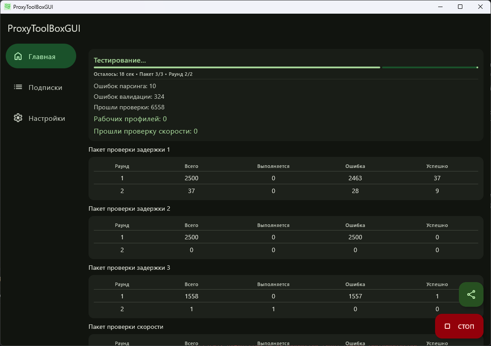

# ProxyToolBoxGUI 


[English](README.md) | [Русский](README-ru.md)

> [!WARNING]
> Этот проект почти полностью написан с использованием ИИ. Если у вас аллергия на нейрослоп в опенсорсе — пожалуйста, не читайте дальше. В противном случае буду рад конструктивной критике, а ещё лучше — PR-ам с описанием того, что и зачем нужно изменить.

ProxyToolBoxGUI — это кроссплатформенное графическое приложение-компаньон, предназначенное для импорта, очистки, проверки и тестирования профилей конфигурации прокси (например, из подписок VLESS, VMess или ShadowSocks).

Приложение построено на базе Kotlin Multiplatform (KMP) и ориентировано на Android и десктоп-среды (JVM под Windows и Linux), обеспечивая единый интерфейс на мобильных устройствах и компьютерах.

Приложение выступает графической оболочкой для базовой Go-библиотеки [proxytoolbox](https://github.com/BlueGradientHorizon/proxytoolbox). Сетевые задачи, такие как тестирование соединений, парсинг и бенчмаркинг, выполняются на нативной скорости, при этом сохраняется отзывчивый и современный интерфейс в стиле Material 3.



---

## Как это работает

ProxyToolBoxGUI использует гибридную архитектуру:
1. **Пользовательский интерфейс (Kotlin / Compose Multiplatform):** отрисовывает экраны, управляет локальной базой данных SQLite (через Room), координирует задачи и обрабатывает платформенные функции (доступ к буферу обмена, загрузка изображений, сканирование QR-кодов).
2. **Нативный мост (CGO & JNI):** переводит модели данных в Protocol Buffers и передаёт их через нативный JNI-барьер в скомпилированный Go-JNI мост (`gowrapper`).
3. **Основной движок (Go / `proxytoolbox`):** запускает исполняемые файлы воркеров (такие, как Xray или Sing-box) в виде подпроцессов для парсинга конфигураций, проверки их синтаксиса и выполнения параллельных тестов задержки/скорости.

```
[ UI-слой: Compose Multiplatform ]
                │
       (Protocol Buffers / JNI)
                ▼
[ Go JNI-обёртка (CGO-мост) ] ──► [ Go-библиотека proxytoolbox ]
                                               │
                                      (Запуск подпроцессов)
                                               ▼
                                    [ Бинарник воркера ]
```

---

## Важные ограничения и сетевая безопасность

Чтобы обеспечить надёжные результаты тестов и защитить ваше локальное сетевое оборудование, пожалуйста, учитывайте следующие рекомендации:

* **Ограничивайте общее количество профилей:** обычно не рекомендуется тестировать более **10 000 – 12 000 профилей** за один прогон. Большое количество параллельных тестовых запросов может легко перегрузить домашний роутер, исчерпать таблицы соединений (NAT-пулы) или даже вызвать перезагрузку слабых роутеров.
* **Следите за размером пакета:** не выставляйте в настройках слишком большой размер пакета. Массовая отправка параллельных тестовых соединений создаёт физическую перегрузку на вашей линии, из-за чего результаты задержки становятся неточными и ненадёжными.
* **Ограничения веб-сервера на Android:** в приложении встроен легковесный HTTP-веб-сервер для раздачи успешно протестированных рабочих профилей. Однако из-за агрессивного управления фоновой активностью Android сервер может перестать отвечать, когда приложение уходит в фон. На Android обычно надёжнее использовать опции **«Скопировать в буфер обмена»** или **«Экспорт в файл»** для передачи конфигураций.

---

## Возможности и обзор приложения

Приложение состоит из трёх основных разделов, доступных через навигационную панель на мобильных устройствах или боковую панель/меню на десктопе.

### 1. Главный экран (тестирование и результаты)
Главный экран — это основная панель управления. Он отвечает за запуск тестов и мониторинг соединений в реальном времени.

* **Панель состояния:** показывает текущую фазу приложения (Idle — простой, Updating — обновление, Parsing — разбор, Validating — проверка, Testing — тестирование, Completed — завершено) и выводит описания ошибок в случае неудачи.
* **Счётчики в реальном времени:** обновляют статистику по ходу теста, разделяя:
  * **Parsing Errors (ошибки разбора):** синтаксически некорректные строки подключения.
  * **Validation Errors (ошибки валидации):** конфигурации, которые не удалось загрузить в движок маршрутизации.
  * **Passed Checks (прошли проверку):** конфиги, готовые к тестированию задержки.
  * **Working Profiles (рабочие профили):** профили, успешно установившие тестовое соединение с целевым URL.
* **Прогресс-бар теста:** показывает общий прогресс текущего прогона, оценивает оставшееся время и отображает текущий пакет и номер раунда тестирования.
* **Таблицы результатов по пакетам:** отображают статистику производительности для каждого пакета, позволяя увидеть, сколько профилей в данном раунде активны, не прошли тест или успешно прошли.
* **Плавающая кнопка действий (FAB):**
  * Главная кнопка запускает или останавливает тесты.
  * Дополнительное раскрывающееся меню позволяет копировать отфильтрованные рабочие конфиги, экспортировать их в файл `.txt` или переключать локальный сервер подписок.

### 2. Экран подписок (управление фидами)
Здесь вы управляете исходными ссылками на подписки.

* **Сводная статистика:** отображает общее количество найденных профилей, пропущенных дубликатов и итоговое число профилей, доступных для тестирования.
* **Элементы фида:** список ссылок на подписки с пользовательской заметкой, количеством уникальных/рабочих профилей и временем последнего обновления.
* **Переключатель «включить/исключить»:** простой переключатель на карточке позволяет включить или исключить конкретную подписку из следующего тестового прогона, не удаляя её.
* **Режим множественного выбора:** долгое нажатие на подписку включает режим выбора, позволяя удалить сразу несколько фидов или экспортировать выбранные конфиги.
* **Опции добавления/импорта:**
  * **Импорт из буфера обмена:** автоматически разбирает чистые ссылки или строки формата `[Заметка] [URL]` из буфера обмена.
  * **Сканер QR-кодов:** сканирует ссылки подписок камерой устройства или загружает изображение из галереи.
  * **Ручной ввод:** стандартная форма для ввода заметки и URL.
* **Диалог экспорта:** генерирует QR-код для выбранных фидов или копирует их в буфер обмена, с возможностью включить или исключить ваши личные заметки.

### 3. Экран настроек (кастомизация)
Тонкая настройка производительности, потребления памяти и поведения.

* **Внешний вид:** настройка тем оформления (Светлая, Тёмная, Системная) и выбор языка (English, Русский или Системный). На Android 12+ можно включить динамические цвета Monet.
* **Программа-воркер:** показывает обнаруженные бинарные файлы ядер. Можно выбрать, какой бэкенд отвечает за валидацию и маршрутизацию прокси.
* **Производительность тестирования:**
  * **Режим низкого потребления памяти:** при включении приложение завершает и перезапускает процессы воркеров между пакетами. Это снижает расход RAM при тестировании большого количества профилей на устройствах с ограниченной памятью.
  * **Раунды задержки и таймаут:** задаёт, сколько раз каждый профиль будет протестирован, и сколько времени движок должен ждать ответа до срабатывания таймаута.
  * **Пакетное тестирование:** включение/выключение пакетного режима и настройка лимита размера пакета.
  * **URL для замера задержки:** задаёт веб-эндпоинт (например, Google или локальную страницу спидтеста), используемый для измерения задержки.
  * **Дедупликация:** включение/выключение автоматической фильтрации дублирующихся строк подключения (движок сравнивает профили по базовым свойствам, игнорируя визуальные примечания).
* **Бенчмарки скорости:** включение тестирования скорости после замера задержки. Можно задать целевой объём загрузки/выгрузки, количество раундов спидтеста и выбрать провайдера (например, Cloudflare).
* **Настройки веб-сервера:** задание пользовательского порта (1024–65535) и выбор, должен ли веб-сервер слушать только на `localhost` или быть доступен в локальной сети.

---

## Инструкции по сборке

### Предварительные требования
Для сборки приложения на вашей хост-системе должно быть установлено следующее:
* **Java Development Kit (JDK):** версия 21.
* **Go-компилятор:** версия 1.26 или новее.
* **Protobuf-компилятор (`protoc`):** используется для компиляции моделей JNI-payload.
* **C-компилятор:**
  * **Linux:** `gcc` (системный пакет).
  * **Windows:** MinGW-w64 (`x86_64-w64-mingw32-gcc.exe`).
  * **Android:** Android NDK (пути должны соответствовать используемому компилятору).

---

### Шаг 1: Скомпилируйте нативный JNI-враппер
Перед запуском Gradle необходимо скомпилировать Go-обёртку. Скомпилированные бинарники (`.dll` для Windows, `.so` для Linux/Android) используются как ресурсы, которые Kotlin извлекает и загружает во время выполнения.

#### Для десктоп-целей
Запустите следующую make-команду из корневой директории:
```shell
make desktop
```
Она соберёт бинарник под вашу ОС, сгенерирует структуры Protocol Buffers, соберёт Go-библиотеку и скопирует полученный бинарник в `composeApp/src/jvmMain/resources`.

#### Для Android-целей
Убедитесь, что пути `ANDROID_HOME` и NDK настроены корректно, затем выполните:
```shell
make android
```
Эта команда кросс-компилирует Go-библиотеку для четырёх основных Android-архитектур (`arm64-v8a`, `armeabi-v7a`, `x86_64`, `x86`) и размещает их в папке `androidMain/jniLibs`.

---

### Шаг 2: Сборка фронтенд-приложения

Используйте стандартный Gradle wrapper для запуска или упаковки приложения.

#### Сборка и запуск десктоп-приложения (JVM)
* **Для прямого запуска:**
  ```shell
  # На macOS/Linux
  ./gradlew :composeApp:run
  
  # На Windows
  .\gradlew.bat :composeApp:run
  ```
* **Для упаковки локального дистрибутива:**
  ```shell
  ./gradlew :composeApp:packageDistributionForCurrentOS
  ```

#### Сборка и упаковка Android-приложения
* **Для компиляции отладочного APK:**
  ```shell
  # На macOS/Linux
  ./gradlew :androidApp:assembleDebug
  
  # На Windows
  .\gradlew.bat :androidApp:assembleDebug
  ```
Готовые APK будут созданы в `androidApp/build/outputs/apk/debug/`.
