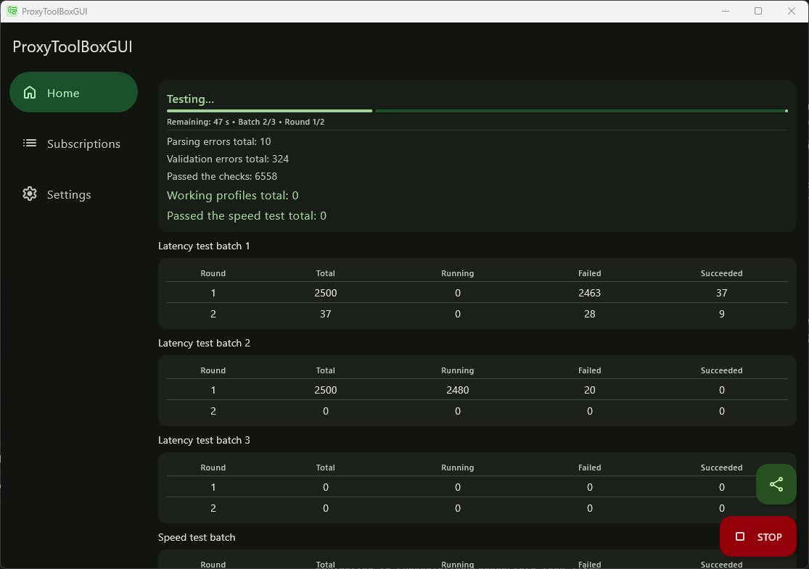

# ProxyToolBoxGUI


[English](README.md) | [Русский](README-ru.md)

> [!WARNING]
> This project is almost fully written using AIs. If you're allergic to AI-slop open source software, please leave. Otherwise, I'll be glad to hear some constructive criticism or even better to see PRs with descriptions on what and why something is needed to be changed.

ProxyToolBoxGUI is a cross-platform graphical companion app designed to help you import, clean, validate, and benchmark proxy configuration profiles (such as those from VLESS, VMess, or ShadowSocks subscription feeds).

It is built as a Kotlin Multiplatform (KMP) application targeting Android and Desktop environments (JVM on Windows and Linux), offering a unified experience across mobile and desktop.

The application serves as a graphical user interface for the underlying [proxytoolbox Go library](https://github.com/BlueGradientHorizon/proxytoolbox). It handles network-heavy connection testing, parsing, and benchmarking at native speeds while maintaining a responsive, modern Material 3 interface.



---

## How It Works

ProxyToolBoxGUI relies on a hybrid architecture:
1. **User Interface (Kotlin / Compose Multiplatform):** Draws the screens, manages the local SQLite database (via Room), coordinates tasks, and handles platform features (like clipboard access, image loading, and QR code reading).
2. **Native Bridge (CGO & JNI):** Translates data models into Protocol Buffers and sends them across a native JNI barrier to a compiled Go JNI bridge (`gowrapper`).
3. **Core Engine (Go / `proxytoolbox`):** Spins up worker core binaries (such as Xray or Sing-box) as subprocesses to parse configurations, validate their syntax, and run parallel latency/speed tests.

```
[ UI Layer: Compose Multiplatform ]
               │
      (Protocol Buffers / JNI)
               ▼
[ Go JNI Wrapper (CGO Bridge) ] ──► [ proxytoolbox Go Library ]
                                              │
                                     (Spawns subprocesses)
                                              ▼
                                   [ Core Worker Binary ]
```

---

## Important Usage Limits & Network Safety

To ensure reliable test results and protect your local network equipment, please keep the following recommendations in mind:

* **Limit Total Profile Counts:** It is generally not recommended to test more than **10,000 to 12,000 profiles** in a single test run. Large quantities of parallel test requests can easily saturate home routers, exhaust their connection states (NAT pools), or even cause low-end routers to crash and reboot.
* **Be Mindful of Batch Size:** Do not set the batch size to an excessively high value in the settings. Flooding your network interface with too many parallel connection tests creates physical congestion on your line, which makes latency results inaccurate and unreliable.
* **Android Web Server Restrictions:** The app contains a built-in lightweight HTTP Web Server to host your successfully tested working profiles. However, due to Android's aggressive background power management, the server may stop responding when the app is placed in the background. On Android, it is usually more reliable to use the **Copy to clipboard** or **Export to file** options to transfer your configurations.

---

## Features & App Tour

The application is structured around three primary sections, accessible from the navigation bar on mobile or the navigation rail/drawer on desktop.

### 1. Home Screen (Testing & Results)
The Home screen is your primary dashboard. It handles the execution and real-time monitoring of connection tests.

* **Status Dashboard:** Shows the current phase of the application (Idle, Updating, Parsing, Validating, Testing, or Completed) and prints descriptive errors if a test fails.
* **Real-Time Counters:** Updates live statistics during the test run, separating:
  * **Parsing Errors:** Syntactically broken connection strings.
  * **Validation Errors:** Configurations that failed to load into the routing engine.
  * **Passed Checks:** Configs ready for latency testing.
  * **Working Profiles:** Profiles that successfully established a test handshake with the target URL.
* **Test Progress Bar:** Shows the overall progress of the current test run, estimating the remaining time and showing the current batch and test round numbers.
* **Batch Results Tables:** Displays performance statistics for individual batch runs, allowing you to see how many profiles in a given round are active, failed, or succeeded.
* **Floating Action Menu (FAB):**
  * The main action button starts or stops tests.
  * A secondary expandable menu lets you copy filtered working configs, export them to a `.txt` file, or toggle the local subscription server.

### 2. Subscriptions Screen (Feed Management)
This is where you manage your source subscription links.

* **Aggregate Statistics:** Displays the total count of profiles discovered, duplicates skipped, and the net profiles eligible for testing.
* **Feed Items:** Lists each subscription link with its custom note, unique/working profile counts, and the last update timestamp.
* **Include/Exclude Toggle:** A simple switch on each card allows you to include or exclude specific subscriptions from the next test run without deleting them.
* **Multi-Select Mode:** Long-press any subscription to enter selection mode, allowing you to delete several feeds at once or export selected configs.
* **Add / Import Options:**
  * **Clipboard Import:** Automatically parses clean links or lines containing `[Note] [URL]` formats from your clipboard.
  * **QR Code Scanner:** Scans subscription links using your device's camera or loads an image file from your gallery.
  * **Manual Entry:** Standard form for typing notes and URLs.
* **Export Dialog:** Generates a shareable QR code for selected feeds or copies them to your clipboard, with an option to include or exclude your personal notes.

### 3. Settings Screen (Customization)
Fine-tune performance, memory footprint, and behavior.

* **Appearance:** Adjust application themes (Light, Dark, System) and select languages (English, Russian, or System). On Android 12+, you can enable Monet dynamic color matching.
* **Worker Program:** Displays discovered core test binaries. You can choose which backend handles the validation and proxy routing.
* **Testing Performance:**
  * **Low Memory Mode:** When enabled, the app terminates and re-initializes worker processes between individual batches. This keeps RAM usage low on memory-constrained systems during large profile tests.
  * **Latency Rounds & Timeout:** Configure how many times each profile is tested and how long the engine should wait for a handshake before timing out.
  * **Batch Testing:** Toggle batching on or off and configure batch size limits.
  * **Latency Target URL:** Define which web endpoint (e.g., Google or a local speed-test page) is used to measure latency.
  * **Deduplication:** Enable or disable automatic filtering of duplicate connection strings (the engine compares profiles by base properties, ignoring visual remarks).
* **Speed Benchmarks:** Enable speed-testing after latency tests have run. You can configure target download/upload data sizes, speed-test rounds, and select providers (e.g., Cloudflare).
* **Web Server Config:** Set custom port values (1024–65535) and specify whether the web server should bind only to `localhost` or open up to your local network.

---

## Build Instructions

### Prerequisites
To build the application, ensure you have the following installed on your host system:
* **Java Development Kit (JDK):** Version 21.
* **Go Compiler:** Version 1.26 or later.
* **Protobuf Compiler (`protoc`):** Used to compile the JNI payload models.
* **C Compiler:**
  * **Linux:** `gcc` (system package).
  * **Windows:** MinGW-w64 (`x86_64-w64-mingw32-gcc.exe`).
  * **Android:** Android NDK (specifically matching the compiler paths).

---

### Step 1: Compile the Native JNI Wrapper
You must compile the Go-based wrapper before running Gradle. The compiled binaries (`.dll` on Windows, `.so` on Linux/Android) act as resources that Kotlin extracts and loads at runtime.

#### For Desktop Targets
Run the following make command from the root directory:
```shell
make desktop
```
This targets your host OS, generates the Protocol Buffer structures, builds the Go library, and copies the resulting binary into `composeApp/src/jvmMain/resources`.

#### For Android Targets
Ensure your `ANDROID_HOME` and NDK paths are configured correctly, then run:
```shell
make android
```
This cross-compiles the Go library for the four major Android architectures (`arm64-v8a`, `armeabi-v7a`, `x86_64`, `x86`) and places them under the `androidMain/jniLibs` folder.

---

### Step 2: Build the Frontend Application

Use the standard Gradle wrapper to run or package the application.

#### Build and Run Desktop (JVM) App
* **To run directly:**
  ```shell
  # On macOS/Linux
  ./gradlew :composeApp:run
  
  # On Windows
  .\gradlew.bat :composeApp:run
  ```
* **To package a local installation binary:**
  ```shell
  ./gradlew :composeApp:packageDistributionForCurrentOS
  ```

#### Build and Package Android App
* **To compile a debug APK:**
  ```shell
  # On macOS/Linux
  ./gradlew :androidApp:assembleDebug
  
  # On Windows
  .\gradlew.bat :androidApp:assembleDebug
  ```
The output APKs will be generated in `androidApp/build/outputs/apk/debug/`.